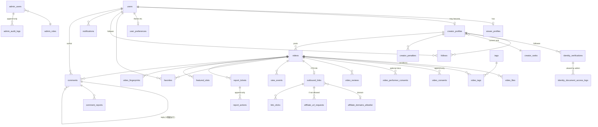
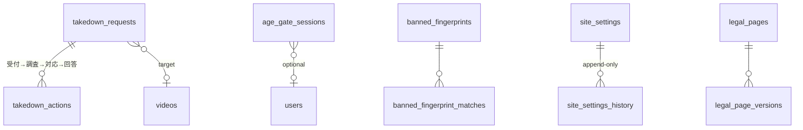

# 03. データモデル（ER図・テーブル定義）

- DB：PostgreSQL 16+。主キーはすべて `uuid`（v7、時系列で並ぶ）、日時はすべて `timestamptz`。
- 🔒 は**追記専用**（`UPDATE` と `DELETE` をトリガーで禁止し、`prev_hash` と `row_hash` でハッシュチェーンにする）。
- 🔐 は**機密**（RLSで限られたロールしか読めない。カラム単位でも暗号化する）。
- 要件で挙がった最小テーブルに、運用のために次のテーブルを足しています：`sessions`、`user_preferences`、`notifications`、`identity_document_access_logs`、`video_performer_consents`、`fraud_flags`、`video_fingerprints`、`rate_limit_buckets`、`job_queue`（pg-boss）。

---

## 1. ER図（主要部分）





---

## 2. テーブル定義

### 2.1 ユーザー・閲覧者

**users**
| カラム | 型 | 説明 |
|---|---|---|
| id | uuid PK | |
| email | citext UNIQUE | |
| email_verified_at | timestamptz | メール確認が済むまでフォローと同期は使えない |
| password_hash | text | argon2id |
| display_name | text | |
| avatar_url | text | |
| status | enum `active / suspended / banned / deleted` | |
| created_at / updated_at | timestamptz | |
| deleted_at | timestamptz | 退会したときに論理削除し、一定期間が過ぎたら匿名化する |

**sessions**：Better Authの標準（id, user_id, token_hash, expires_at, ip_hash, ua_hash）

**viewer_profiles**：user_id PK/FK、`preferred_tag_ids uuid[]`、`onboarded_at`、`muted_default bool`

**user_preferences**（テーマ設定）
| カラム | 型 | 説明 |
|---|---|---|
| user_id | uuid PK FK | |
| theme_id | enum `midnight / rose / ocean / emerald / gold / crimson / minimal / custom` | |
| color_mode | enum `dark / light / system` | |
| custom_tokens | jsonb | `{primary, accent, background, card, text}`（HEX）。保存するときにコントラスト比を検証する（07 §5） |
| sound_on | bool | |
| updated_at | timestamptz | |
> ログインしていない人の設定は `localStorage` に保存し、ログインしたらサーバーと同期します（新しい方を優先）。

**age_gate_sessions**
| カラム | 型 | 説明 |
|---|---|---|
| id | uuid PK | Cookie `ag` には、このIDに署名（HMAC）をつけた値を入れる |
| user_id | uuid NULL | ログインしていれば紐づける |
| accepted_at | timestamptz | |
| expires_at | timestamptz | 既定は30日（`site_settings.age_gate.ttl_days`） |
| ip_hash / ua_hash | text | HMAC-SHA256（ソルトは定期的に入れ替える） |
| gate_version | int | 文言を変えたら同意を取り直す |

### 2.2 投稿者・本人確認

**creator_profiles**
| カラム | 型 | 説明 |
|---|---|---|
| user_id | uuid PK FK | |
| handle | citext UNIQUE | @username |
| bio | text | |
| status | enum `not_applied / pending / approved / rejected / suspended / banned` | B-4 |
| rank_id | FK creator_ranks | |
| approved_posts_count | int | ランクの判定に使う |
| violation_points | int | |
| posting_restricted_until | timestamptz | 投稿制限（D-3） |
| approved_at / created_at | timestamptz | |

**identity_verifications** 🔐
| カラム | 型 | 説明 |
|---|---|---|
| id | uuid PK | |
| creator_user_id | FK | |
| provider | enum `manual / ekyc_x` | |
| status | enum `submitted / in_review / approved / rejected / purged` | |
| birth_date_enc | bytea | 生年月日（アプリ側でエンベロープ暗号化） |
| is_adult_at_submission | bool | 提出時に計算。false なら申請を受け付けない（B-2） |
| document_object_keys_enc | bytea | 本人確認書類用バケットのオブジェクトキー（暗号化） |
| identity_hash | text | 氏名・生年月日・書類番号を正規化してHMACしたもの（BANした人の再登録を照合する。D-4） |
| reviewed_by / reviewed_at / reject_reason | | |
| purge_after | timestamptz | 承認・却下の日 + `retention.kyc_days` |
| purged_at | timestamptz | 書類を削除したあとも、`identity_hash` と結果だけは残す |

**identity_document_access_logs** 🔒：id, verification_id, admin_user_id, action（`view / download_denied / purge`）, ip_hash, at, prev_hash, row_hash

**creator_ranks**
| カラム | 説明 |
|---|---|
| id, code（`new / standard / trusted`）, name | |
| min_approved_posts | 例：new = 0、standard = 5、trusted = 30 |
| max_violation_points | |
| review_mode | `full`（全件を公開前に審査）/ `auto_plus_sampling`（自動チェック＋抜き打ち） |
| sampling_rate | 例：0.2 |
| daily_post_limit | |
> 閾値は管理画面から変更できます（D-5）。どのランクでも「通報されたら即非公開」は同じです（D-2）。

**creator_penalties** 🔒
id, creator_user_id, level（`warning / restriction / suspension / ban`）, reason_code, reason_text, starts_at, ends_at, issued_by_admin_id, related_report_id, created_at, prev_hash, row_hash
> 解除も「解除」という1行を追記して記録します（元の行は書き換えません）。

**banned_fingerprints**
| カラム | 説明 |
|---|---|
| id, kind（`email / device / identity / payment_none`）, value_hash（HMAC）, source_user_id, created_at, note | |
> 登録・申請のたびに、メール（正規化したもの）、端末の識別子、`identity_hash` を照合します。一致したら `banned_fingerprint_matches` に記録し、管理画面に出します（自動で却下するか、運営の判断にするかは設定で選びます）。

### 2.3 動画

**videos**
| カラム | 型 | 説明 |
|---|---|---|
| id | uuid PK | |
| creator_user_id | FK | |
| title | text（最大60文字） | |
| description | text（最大300文字） | |
| status | enum `uploading / processing / pending_review / published / rejected / hidden_by_report / hidden_by_creator / removed` | |
| visibility_reason | text | 差し戻しや非公開の理由（投稿者にも見せる） |
| review_required | bool | 投稿した時点のランクで決まる |
| provider_video_id | text | |
| duration_sec / width / height | | |
| published_at | timestamptz | |
| report_hidden_at | timestamptz | |
| performer_consent_required | bool | 将来、同意書を必須にするためのフラグ（C-3。既定はfalse、`site_settings` から一括で変更） |
| created_at / updated_at / removed_at | | |

**video_files**：video_id, kind（`hls / thumbnail / poster`）, provider_ref, width, height, bitrate
**tags**：id, slug, name, is_active, is_blocked（禁止ワード）
**video_tags**：video_id, tag_id（1本あたり最大5つ）

**video_consents** 🔒（C-2）
| カラム | 説明 |
|---|---|
| id, video_id, creator_user_id | |
| consent_version | 同意文の版 |
| consent_text_hash | そのときの文面のSHA-256 |
| owns_rights / all_performers_adult_consented / not_reposted | すべてtrueでないと投稿できない（DBのCHECK制約） |
| ip_address_enc / ip_hash / user_agent | 生IPは暗号化して `retention.consent_ip_days` だけ保存 |
| consented_at | |
| prev_hash / row_hash | |

**video_performer_consents**：id, video_id, object_key_enc（本人確認書類用バケット）, performer_count, uploaded_at, reviewed_by, status

**video_reviews** 🔒：id, video_id, reviewer_admin_id, decision（`approve / reject / request_changes`）, reason_code, note, scan_result jsonb, is_sampling bool, created_at, hash

**video_fingerprints**：video_id, sha256, phash_frames bigint[], created_at（重複検知。インデックスはGIN/BK-treeを想定）

### 2.3.1 コメント（2026-10-03の決定で追加）

**comments**
| カラム | 型 | 説明 |
|---|---|---|
| id | uuid PK | |
| video_id | FK | |
| author_user_id | FK | **ログインしていて、メール確認が済んだ会員だけ**が書ける |
| parent_id | uuid NULL | 返信。1階層までにする（スレッドを深くしない） |
| body | text（最大300文字） | URLは書けない（自動で拒否）。NGワードのフィルタを通す |
| status | enum `visible / pending / hidden_by_report / hidden_by_creator / removed` | NGワードに近い表現は `pending`（運営の確認待ち）にする |
| like_count | int | |
| created_at / edited_at / removed_at | | |

**comment_reports**：id, comment_id, reason（`harassment / personal_info / spam / minor_related / other`）, reporter_user_id NULL, reporter_key_hash, created_at
> `minor_related`（未成年に関わる書き込み）は1件でも通報されたら即非表示にします。それ以外は件数が閾値を超えたら非表示にします。

**comment_settings**（動画ごと）：video_id PK, enabled bool（投稿者がコメントを止められる）, followers_only bool
**ng_words**：id, pattern, match_type（`exact / contains / regex`）, action（`reject / pending`）, created_by

### 2.4 視聴者の行動

**favorites**：user_id, video_id, created_at（PKは2つの組み合わせ）。ログインしていない人の分は端末に保存し、ログインしたらまとめてPOSTして同期します。
**follows**：follower_user_id, creator_user_id, created_at
**view_events**（日付でパーティションを分ける）
| カラム | 説明 |
|---|---|
| id, video_id, viewer_key（ログイン時はuser_id、未ログイン時は端末IDのハッシュ）, session_id | |
| watched_ms, duration_ms, exit_position_ms, completed bool | 視聴時間と離脱位置 |
| ip_hash, ua_class（`browser / bot / unknown`）, is_valid, invalid_reason | |
| occurred_at | |
> 投稿者のダッシュボードは、ここから日別に集計した `video_daily_stats` を読みます（ログの中身には触れさせません）。

**video_daily_stats**：video_id, date, views, unique_viewers, favorites, valid_clicks, avg_watch_ms

### 2.5 アフィリエイト・外部リンク

**affiliate_domains_allowlist**：id, domain（eTLD+1）, display_name, is_active, added_by, added_at, removed_at, healthcheck_url, notes

**outbound_links**
| カラム | 説明 |
|---|---|
| id（`/out/:id` で使う公開ID。推測されにくいもの） | |
| video_id, creator_user_id | |
| url（正規化済み）, domain | |
| status | `active / pending_domain_review / rejected / disabled_domain_removed / disabled_healthcheck / disabled_by_admin` |
| last_healthcheck_at, last_healthcheck_status, final_redirect_domain | |

**affiliate_url_requests**：id, outbound_link_id, requested_domain, status（`pending / approved / rejected`）, reviewer_admin_id, add_to_allowlist bool, note
**link_clicks**：id, outbound_link_id, video_id, viewer_key, ip_hash, ua_hash, is_valid, invalid_reason（`dup_window / bot / self_click / rate`）, clicked_at
**fraud_flags**：id, subject_type（`creator / video / viewer_key`）, subject_id, kind（`self_view / self_click / burst / dup_device`）, score, evidence jsonb, status（`open / dismissed / actioned`）, created_at

### 2.6 通報・削除請求

**report_tickets**
| カラム | 説明 |
|---|---|
| id, video_id | |
| reason | `minor_suspected / non_consensual / unauthorized_repost / inappropriate / other`（`inappropriate` はQ3-3で採用が決まったら追加） |
| detail_text | 「その他」のときは必須（最大1,000文字） |
| reporter_user_id NULL, reporter_key_hash | 匿名でも通報できる（E-4） |
| priority | `P0`（未成年・非同意）/ `P1` / `P2` |
| sla_due_at | 既定はP0が24時間、P1が72時間、P2が7日（設定で変更可） |
| status | `open / in_review / resolved_restored / resolved_removed / dismissed` |
| auto_hidden bool | |
| created_at | |

**report_actions** 🔒：id, ticket_id, admin_user_id, action（`assign / hide / restore / remove / penalize / note / police_referral`）, note, created_at, hash

**takedown_requests**（G-3）：id, requester_name, requester_email, requester_type（`本人 / 権利者 / 代理人 / その他`）, target_url, video_id, claim_type（`著作権 / 肖像権 / プライバシー / 名誉毀損 / その他`）, detail, evidence_object_keys, status（`received / investigating / actioned / answered / rejected`）, due_at, created_at
**takedown_actions** 🔒：id, request_id, admin_user_id, action, note, created_at, hash

### 2.7 運営・設定

**admin_roles**：id, code（`super_admin / reviewer / report_handler / identity_officer`）, permissions text[]
**admin_users**：id, user_id, role_id, totp_enabled（必須。falseなら管理画面にログインできない）, allowed_ip_cidrs cidr[] NULL, last_login_at, is_active
**admin_audit_logs** 🔒（G・管理画面9）：id, admin_user_id, action, target_type, target_id, before jsonb, after jsonb, ip_hash, ua, created_at, prev_hash, row_hash
**featured_slots**：id, video_id, position, starts_at, ends_at, created_by
**rankings_cache**：kind（`weekly / monthly / rookie / popular_score`）, period_key, video_id, rank, score, computed_at
**site_settings**：key text PK, value jsonb, updated_by, updated_at（変更前の値は `site_settings_history` 🔒 に残す）
**legal_pages**：slug（`terms / privacy / guidelines / takedown-policy / operator / tokushoho`）, current_version_id, is_published
**legal_page_versions**：id, slug, body_md, is_draft_notice（「弁護士確認前の仮文面です」を表示するかどうか）, published_at, created_by
**notifications**：id, user_id, kind（`video_rejected / warning / suspended / approved ...`）, payload jsonb, read_at, created_at

### 2.7.1 地域ポリシー（2026-10-03の決定で追加）

**geo_policies**
| カラム | 説明 |
|---|---|
| region_code（PK） | ISO 3166-1の国コード、または `US-TX` のような州コード |
| mode | `allow`（自己申告ゲートだけ）/ `require_strong_age_assurance`（強い年齢確認が必要）/ `block`（提供しない） |
| legal_basis | 根拠になる法令のメモ |
| updated_by / updated_at | |
> 国・地域はCDNが付けるヘッダ（例：`CF-IPCountry`）、またはGeoIPで判定します。生のIPは保存しません。強い年齢確認（第三者の年齢確認サービス）を入れるまでは、`require_strong_age_assurance` の地域は実質的に `block` と同じ扱いにします。

### 2.8 `site_settings` の主なキー（初期値）
```jsonc
{
  "age_gate.ttl_days": 30,
  "review.new_creator_full_review_count": 5,
  "review.trusted_sampling_rate": 0.2,
  "report.auto_hide_reasons": ["minor_suspected", "non_consensual"],
  "report.auto_hide_threshold.unauthorized_repost": 3,
  "report.auto_hide_threshold.other": 5,
  "report.sla_hours": { "P0": 24, "P1": 72, "P2": 168 },
  "ranking.popular_formula": { "w_views": 1.0, "w_clicks": 3.0, "w_momentum": 2.0, "half_life_hours": 48 },
  "ranking.rookie_days": 30,
  "clicks.dedupe_window_sec": 1800,
  "retention.kyc_days": 90,
  "retention.raw_ip_days": 30,
  "retention.view_events_days": 180,
  "operator.display_mode": "contact_only",   // contact_only / corporation / agent
  "operator.contact_email": "",
  "performer_consent.required": false,
  "ui.default_theme": "midnight",
  "comments.enabled": true,
  "comments.auto_hide_threshold": 3,
  "comments.rate_limit_per_hour": 20,
  "geo.default_mode": "allow"
}
```

---

## 3. 権限分離（RLS）の方針

- アプリはDBに `app_user` ロールで接続し、リクエストごとに `SET LOCAL app.user_id`、`app.admin_role`、`app.age_gate_ok` を設定します。
- `videos`：公開されているものを読めるのは `status='published' AND current_setting('app.age_gate_ok')='true'` のときだけ。投稿者本人は自分の動画をすべて読めます。
- `identity_verifications` と本人確認書類用バケット：`identity_officer` と `super_admin` だけが読めます。読むときは、アクセスログに1行追記する関数（`SECURITY DEFINER`）を通さないと読めないようにします。
- 🔒のテーブル：`app_user` には `INSERT` と `SELECT` だけを許可します。さらにトリガーで `UPDATE` と `DELETE` を例外にします。マイグレーションに使うロールはアプリの実行時には使いません。
- `view_events` の生データ、`fraud_flags`、IPのハッシュ：運営ロールだけが読めます。投稿者は `video_daily_stats` の自分の行だけを読めます。
