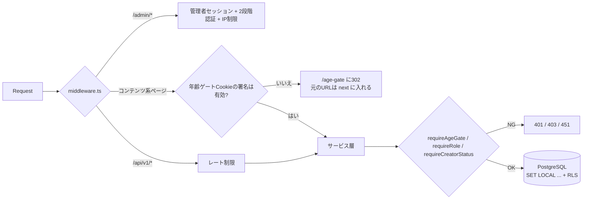
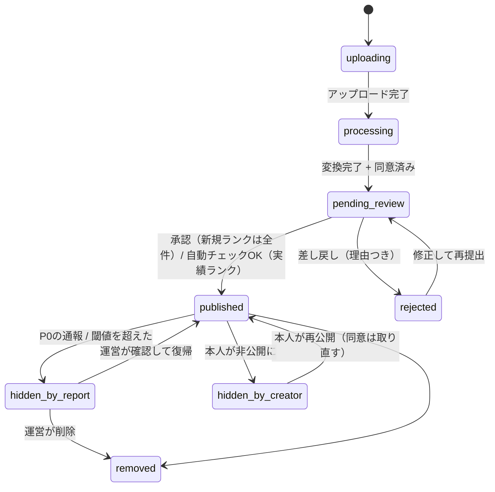

# 04. API設計

- 方式：Next.js の Route Handlers（`/api/v1/...`）を使い、JSONでやりとりします。画面の表示はServer Componentsから同じサービス層を直接呼びます（APIを経由しない）が、**認可のチェックはサービス層の入口に1か所だけ置き**、どちらの経路でも同じ判定を通します。
- エラーの形式：`{ "error": { "code": "AGE_GATE_REQUIRED", "message": "..." } }`
- 認証：Cookieでセッションを持ちます（`HttpOnly; Secure; SameSite=Lax`）。状態を変えるリクエストにはCSRFトークンを付けるか、Originヘッダを検証します。
- 表の「Gate」列は、年齢ゲートへの同意が必要なAPIです（✓）。

---

## 1. 共通の前段処理（ミドルウェアとサービス層）



## 2. 年齢ゲート（A-1〜A-4）

| Method | Path | 認証 | Gate | 説明 |
|---|---|---|---|---|
| GET | `/age-gate` | — | — | ゲート画面。`<meta name="robots" content="noindex,nofollow">` と `X-Robots-Tag: noindex` を付ける。**動画・サムネイル・タイトル・タグは一切出さない** |
| POST | `/api/v1/age-gate/accept` | — | — | `age_gate_sessions` を作り、署名付きのCookie `ag` を発行（有効期限つき）して、`next` へ戻す（`next` は自サイト内のパスだけを許可し、オープンリダイレクトを防ぐ） |
| POST | `/api/v1/age-gate/decline` | — | — | `/leave` へ移動。Cookieは発行しない |

- Cookieは `ag=<session_id>.<HMAC>` という形にします。サーバーでは①HMACが正しいか ②DBにその行があり期限内か（キャッシュは60秒まで）③`gate_version` が最新か、を確かめます。
- **APIを直接呼ばれた場合**：Gateが✓のAPIは、同意していなければ `451` と `{code:"AGE_GATE_REQUIRED"}` だけを返し、本文には何も含めません。
- **RLSでも二重に守る**：DB接続ごとに `app.age_gate_ok` を設定し、`videos` の公開ポリシーで条件にしています。サービス層のチェックに漏れがあっても、DBからは何も返りません。
- 検索エンジン向け：`/age-gate`、`/leave`、法務ページ以外は `robots.txt` でクロールを禁止し、すべて `noindex` にします。サイトマップは法務ページだけを載せます。
- 署名付き動画URLの有効期限は短くし（例：10分）、`ag` のセッションIDに紐づけます。

### 2.1 地域ポリシー（海外からのアクセス）
- ミドルウェアで国・地域を判定し、`geo_policies` を見て処理を分けます。
  - `allow`：通常どおり、年齢ゲートを表示
  - `require_strong_age_assurance`：強い年齢確認が済むまでコンテンツを出さない（今は対応していないので「この地域ではご利用いただけません」と表示）
  - `block`：`451 Unavailable For Legal Reasons` と案内ページを表示
- 判定できない場合は `geo.default_mode` に従います。VPNを使った回避を完全に防ぐことはできないため、規約で禁止し、地域の判定を試みたことを記録に残します。

## 3. 認証

| Method | Path | 説明 |
|---|---|---|
| POST | `/api/v1/auth/signup` | メール+パスワード。レート制限（IPごと：5回/時）。BANされた人のリストと照合 |
| POST | `/api/v1/auth/verify-email` | |
| POST | `/api/v1/auth/login` | 失敗が続いたら段階的に待たせる |
| POST | `/api/v1/auth/logout` | |
| POST | `/api/v1/auth/password/reset` | |
| POST | `/api/v1/admin/auth/totp/verify` | 管理者は2段階認証を通るまで、どの管理APIも使えない |

## 4. 閲覧者（すべてGate ✓）

| Method | Path | 説明 |
|---|---|---|
| GET | `/api/v1/feed?tab=recommended\|popular\|following&cursor=` | カーソル方式のページング。`recommended`（おすすめ）は新着順に、好きなタグとフォローの重みを掛けたもの。1回で5件、残り2件になったら次を取得。`following` はログインが必要 |
| GET | `/api/v1/videos/:id` | 1件の詳細（再生URLは別のAPI） |
| POST | `/api/v1/videos/:id/playback` | 署名付きのHLS URLを発行（期限は短め）。レート制限あり |
| POST | `/api/v1/videos/:id/view-events` | 視聴時間・離脱位置を送る（`navigator.sendBeacon` を使い、まとめて送る） |
| GET | `/api/v1/tags?popular=1` / `/api/v1/tags/:slug/videos` | |
| GET | `/api/v1/creators/:handle` / `/api/v1/creators/:handle/videos` | |
| GET | `/api/v1/search?q=&type=tag\|creator` | pg_trgmで部分一致。1文字だけの検索はできない |
| GET | `/api/v1/rankings?kind=weekly\|monthly\|rookie` | |
| GET | `/api/v1/featured` | |
| GET/PUT/DELETE | `/api/v1/me/favorites` `/api/v1/me/favorites/:videoId` | ログインが必要。`POST /api/v1/me/favorites/sync` で端末に保存した分をまとめて取り込む |
| PUT/DELETE | `/api/v1/me/follows/:creatorId` | ログインが必要 |
| PUT | `/api/v1/me/onboarding/tags` | 好きなタグを保存。未ログインの人はCookieとlocalStorageに保存 |
| GET/PUT | `/api/v1/me/preferences` | テーマ（`theme_id` / `color_mode` / `custom_tokens`）、音の設定。`custom_tokens` は保存時にコントラストを検証する（07 §5） |

### 人気スコア（設定で変えられる）
```
score = (w_views * log1p(valid_views_7d) + w_clicks * log1p(valid_clicks_7d)
         + w_momentum * log1p(valid_views_24h)) * 0.5^(age_hours / half_life_hours)
```
- 初回に選んだタグは、フィードを組むときに「好きなタグが付いた動画を1.3倍」のように重みとして掛けます（倍率は設定で変更可）。

## 5. 投稿者の申請と本人確認（B）

| Method | Path | 権限 | 説明 |
|---|---|---|---|
| POST | `/api/v1/creator/apply` | ログイン済み | `creator_profiles.status = pending`。BANリストと照合 |
| POST | `/api/v1/creator/identity/upload-url` | 申請者 | 本人確認書類用バケットに直接アップロードするための署名付きPUT URLを発行（5分有効、サイズと形式を制限） |
| POST | `/api/v1/creator/identity/submit` | 申請者 | 生年月日を受け取り、**18歳未満なら422で受け付けない**（B-2）。`identity_hash` を計算 |
| GET | `/api/v1/creator/status` | 申請者 | 進捗（申請 → 書類提出 → 審査中 → 承認/却下） |

## 6. 投稿（C）

| Method | Path | 権限 | 説明 |
|---|---|---|---|
| POST | `/api/v1/creator/videos` | `approved` で制限中でない | 下書きを作り、tusのアップロードURLを発行。1日の投稿上限をチェック |
| PATCH | `/api/v1/creator/videos/:id` | 本人 | タイトル、説明、タグ（最大5つ）、リンクURL |
| POST | `/api/v1/creator/videos/:id/performer-consent/upload-url` | 本人 | 出演者の同意書（任意。フラグによっては必須） |
| POST | `/api/v1/creator/videos/:id/submit` | 本人 | **3つの同意がすべてtrueでなければ422**。`video_consents` に追記（IP、UA、日時、文面のハッシュ）。リンクを検証（§7）。ランクに応じて `pending_review` にするか、自動チェックへ回す |
| POST | `/api/v1/creator/videos/:id/unpublish` / `DELETE` | 本人 | 自分の判断でいつでも非公開・削除できる |
| GET | `/api/v1/creator/videos?status=` | 本人 | 一覧と、差し戻しの理由 |
| GET | `/api/v1/creator/stats?from=&to=` | 本人 | `video_daily_stats` から**自分の動画の分だけ**を返す |
| GET | `/api/v1/creator/notifications` | 本人 | |
| POST | `/api/v1/webhooks/video-provider` | 署名を検証 | 変換完了などの通知 → `video.ingest` ジョブ |

### 公開までの状態遷移


## 7. アフィリエイトURL（F）

**URLの検証（保存するときに毎回実行）**
1. `new URL()` で読めること。`https:` だけを許可
2. ホスト名がIPアドレス（v4/v6、10進数・16進数の表記も含む）なら拒否
3. 国際化ドメインはpunycodeに直して比較。同じ形に見える文字（ホモグラフ）を含むものは拒否
4. 短縮URLやリダイレクタのドメインのリスト（bit.ly、t.co、goo.gl など。設定で管理）に当たれば拒否
5. `javascript:`、`data:`、ユーザー情報（`user@host`）、ポート指定、改行やNUL、二重にエンコードされた文字列は拒否
6. eTLD+1が `affiliate_domains_allowlist` で有効 → `active`。リストにない → `pending_domain_review` にして `affiliate_url_requests` に登録（承認されるまでCTAは表示しない）

| Method | Path | 説明 |
|---|---|---|
| GET | `/out/:id` | Gate ✓。確認画面（移動先のドメイン、PR表記、移動する/戻る）。`noindex` |
| POST | `/api/v1/out/:id/go` | クリックを記録（§10の除外ルールを適用）→ `{ url }` を返す。リンクが `active` でなければ410 |
> 遷移するときは `rel="noopener noreferrer"` を付け、`Referrer-Policy: no-referrer` にして自サイトのURLを外に漏らしません。

## 8. 通報（E）

| Method | Path | 説明 |
|---|---|---|
| POST | `/api/v1/videos/:id/reports` | Gate ✓。ログインは不要。レート制限（端末とIPで10回/時、同じ動画には1回だけ）。Turnstileなどのbot対策を後から入れられるようにしておく |

処理（1つのトランザクションで行う）：
1. `report_tickets` に登録し、`priority` と `sla_due_at` を計算
2. 理由が `minor_suspected` か `non_consensual` → **すぐに `videos.status = hidden_by_report`**。キャッシュを消し、署名付きURLを失効させる
3. それ以外の理由 → 同じ理由で、まだ処理していない通報の数を数え、閾値以上なら非公開にする
4. `report_actions` に「auto_hide」を追記し、管理画面に通知

### 8.1 コメント
| Method | Path | 説明 |
|---|---|---|
| GET | `/api/v1/videos/:id/comments?cursor=` | Gate ✓。表示されているものだけを新しい順に返す |
| POST | `/api/v1/videos/:id/comments` | 会員でメール確認済み。レート制限は1時間に20件。URLは拒否。NGワードに当たれば `reject` か `pending`。BAN・停止中の人は書けない |
| DELETE | `/api/v1/comments/:id` | 書いた本人 |
| POST | `/api/v1/comments/:id/hide` | 動画の投稿者が、自分の動画についたコメントを非表示にする |
| PUT | `/api/v1/creator/videos/:id/comment-settings` | 投稿者がコメントのオン/オフ、フォロワー限定を切り替える |
| POST | `/api/v1/comments/:id/reports` | 通報。`minor_related` は即非表示、それ以外は閾値で非表示 |
| GET/POST | `/api/v1/admin/comments` / `/api/v1/admin/ng-words` | report_handler。コメントの審査キューとNGワードの管理 |

## 9. 管理画面API（`/api/v1/admin/*`、すべて2段階認証と監査ログが必要）

| 領域 | 主なエンドポイント | 必要なロール |
|---|---|---|
| ダッシュボード | `GET /admin/summary` | 全ロール |
| 動画審査 | `GET /admin/reviews?queue=` / `POST /admin/reviews/:videoId` {decision, reason_code, note} | reviewer |
| 通報 | `GET /admin/reports?sort=priority,sla` / `POST /admin/reports/:id/actions` | report_handler |
| 投稿者 | `GET /admin/creators` / `POST /admin/creators/:id/approve\|reject` | reviewer |
| 本人確認書類 | `GET /admin/identity/:verificationId/document` → **閲覧ログを書いてから**、60秒だけ有効な署名付きURLを返す。ダウンロードはできない（インライン表示のみ、透かし入り） | identity_officer |
| 制裁 | `POST /admin/creators/:id/penalties` {level, reason} | reviewer / report_handler（BANはsuper_adminのみ） |
| 許可ドメイン | `GET/POST/DELETE /admin/domains` | super_admin |
| URL審査 | `GET /admin/url-requests` / `POST /admin/url-requests/:id` {approve, add_to_allowlist} | reviewer |
| 削除請求 | `GET /admin/takedowns` / `POST /admin/takedowns/:id/actions` | report_handler |
| 特集・ランキング・閾値 | `PUT /admin/featured` / `PUT /admin/settings/:key` | super_admin |
| 運営者表示 | `PUT /admin/settings/operator.*` | super_admin |
| 法務ページ | `POST /admin/legal/:slug/versions` | super_admin |
| 監査ログ | `GET /admin/audit-logs?actor=&target=` | super_admin |
| 不正フラグ | `GET /admin/fraud-flags` / `POST /admin/fraud-flags/:id` | report_handler |
| 管理者 | `POST /admin/users` / `PUT /admin/users/:id/role` | super_admin |

公開API（ログイン不要）：`POST /api/v1/takedowns`（削除請求・権利侵害申告フォーム。受付番号と確認メールを返す）、`POST /api/v1/contact`

## 10. 不正対策のルール

| 対象 | ルール（初期値。設定で変更可） |
|---|---|
| クリックの重複 | 同じ `viewer_key` から同じリンクへ30分以内 → 無効（`dup_window`） |
| bot | UAが既知のbot、Headless、JSのチャレンジに失敗、1分に20回以上 → 無効（`bot`） |
| 本人のクリック | `viewer_key` が投稿者本人、または投稿者がログインしたことのある端末のハッシュ → 無効（`self_click`） |
| 自作自演の疑い | 同じ端末やIPのハッシュからの再生・クリックが、その動画全体の30%を超え、かつ一定数以上 → `fraud_flags` |
| スクレイピング | フィードと再生URLの発行にレート制限（IPと端末ごと）。再生URLは署名付きで10分有効。HLSのセグメントもトークンで保護 |
| 登録スパム | メール確認が必須。登録はIPごとに5回/時。使い捨てメールのドメインを拒否（リストは設定で管理） |
| 重複投稿 | SHA-256が一致 → 自動で差し戻し。サムネイルのpHashが近い → 審査の画面に「類似あり」と表示 |
