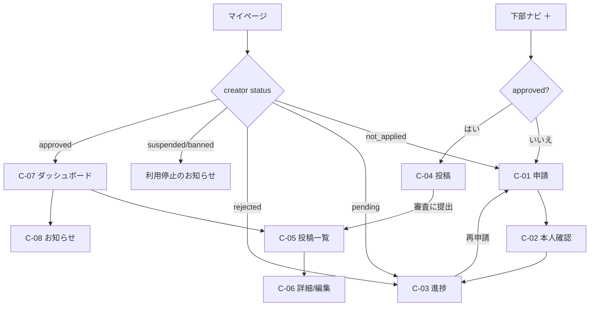

# 05. 画面一覧と画面遷移図

添付のUI画像（①フィード ②年齢確認 ③通報 ④投稿 ⑤外部遷移 ⑥ダッシュボード）にある画面には「画像あり」と書いています。それ以外の画面は、同じデザインシステム（07）で新しく設計します。

---

## 1. 閲覧者

| ID | パス | 画面 | 備考 |
|---|---|---|---|
| V-01 | `/age-gate` | 年齢確認（画像あり②） | 全ページの入口。noindex |
| V-02 | `/leave` | 退出 | 「ご利用いただけません」と表示し、外部のトップページへのリンクだけを置く |
| V-03 | `/welcome/tags` | 好きなタグの選択（初回のみ） | スキップできる。チップを3〜10個選ぶ |
| V-04 | `/` | フィード（画像あり①⑦） | タブ：おすすめ/人気/フォロー中 |
| V-05 | （シート） | 通報（画像あり③） | Bottom Sheet。URLは `?report=1` |
| V-06 | （シート） | 共有 | URLをコピー、Web Share APIで共有 |
| V-07 | （シート） | その他 | 興味なし、この投稿者を非表示、通報 |
| V-08 | `/out/:id` | 外部遷移の確認（画像あり⑤） | |
| V-09 | `/explore` | 探す（検索、人気のタグ、ランキング、新人枠、特集） | |
| V-10 | `/tags/:slug` | タグ別の一覧 | 2列のグリッド → タップするとそこから縦フィードで見られる |
| V-11 | `/search?q=` | 検索結果（タグ / 投稿者） | |
| V-12 | `/@:handle` | 投稿者ページ | |
| V-13 | `/favorites` | お気に入り | 未ログインなら端末に保存した分を表示し、ログインを勧めるバナーを出す |
| V-14 | `/me` | マイページ | 未ログインならログインと登録への導線 |
| V-15 | `/settings` | 設定 | 「デザイン・テーマ」を一番上に、大きなカードで目立たせる |
| V-16 | `/settings/theme` | テーマ設定 | プレビュー、テーマカード、ダーク/ライト/システム |
| V-17 | `/settings/theme/custom` | テーマのカスタマイズ | カラーピッカー5項目、保存して適用、リセット |
| V-18 | `/login` `/signup` `/verify-email` `/reset-password` | 認証 | |
| V-19 | `/legal/:slug` | 法務ページ | 年齢ゲートの外。indexしてよい |
| V-20 | `/takedown` | 削除請求・権利侵害申告フォーム | 年齢ゲートの外 |
| V-21 | `/settings/reports` | 自分の通報履歴 | ログインしている場合 |
| V-22 | `/settings/blocks` | ブロックリスト | 非表示にした投稿者 |
| V-23 | （シート） | コメント | 下から高さ70%で出るシート。一覧、返信（1階層）、入力欄（未ログインならログインへの導線）、各コメントの「…」から通報 |
| V-24 | `/unavailable` | 地域による提供停止 | `geo_policies` が block の地域。noindex |

```mermaid
flowchart TD
  START((初回アクセス)) --> GATE[V-01 年齢確認]
  GATE -->|いいえ| LEAVE[V-02 退出]
  GATE -->|はい| FIRST{初回?}
  FIRST -->|はい| TAGS[V-03 タグ選択]
  FIRST -->|いいえ| FEED
  TAGS -->|選択 or スキップ| FEED[V-04 フィード]
  FEED -->|上下スワイプ| FEED
  FEED -->|通報アイコン| REPORT[V-05 通報シート] -->|送信| FEED
  FEED -->|共有| SHARE[V-06] --> FEED
  FEED -->|コメント| COMMENT[V-23 コメントシート] --> FEED
  FEED -->|本編を見る| OUT[V-08 外部遷移確認]
  OUT -->|移動する| EXT((提携先サイト))
  OUT -->|戻る| FEED
  FEED -->|アイコン/@名前| CREATOR[V-12 投稿者ページ]
  FEED -->|検索アイコン| SEARCH[V-11 検索]
  NAV{{下部ナビ}} --> FEED
  NAV --> EXPLORE[V-09 探す] --> TAGLIST[V-10 タグ別] --> FEED
  NAV --> POST[[投稿 → 投稿者フロー]]
  NAV --> FAV[V-13 お気に入り]
  NAV --> ME[V-14 マイページ] --> SET[V-15 設定]
  SET -->|デザイン・テーマ| THEME[V-16 テーマ設定]
  THEME -->|Custom| CUSTOM[V-17 カスタマイズ]
  CUSTOM -->|保存して適用| THEME
  THEME -->|このテーマを適用| SET
  SET --> LEGAL[V-19 法務ページ]
```

### フィードの操作仕様
| 操作 | モバイル | PC |
|---|---|---|
| 次の動画 / 前の動画 | 上下にスワイプ（CSSの `scroll-snap-type: y mandatory` ＋ IntersectionObserver） | ↑↓キー、ホイール（1回で1本だけ進む）、J/Kキー |
| 再生 / 停止 | 1回タップ | Space、クリック |
| 一時停止して見る | 長押し（UIを薄くして、静止画として眺められる） | — |
| 音のオン/オフ | 右上のスピーカーアイコン（設定を記憶） | Mキー |
| 先読み | 前後1本ずつのHLSマニフェストと最初のセグメントを読み込む。画面外の動画は `pause()` し、src は3本先までしか持たない（メモリの上限） | 同左 |
| 自動再生 | ミュートで自動再生。端末の「視差効果を減らす」が有効なら自動再生しない | 同左 |

### 動画1本あたりの配置（片手操作を前提、iPhone 15 Pro 393×852pt基準）
- 右側のアクション列：右端から16px、下端のナビの上から**88px**の位置から上へ、アイコン28px＋タップ領域48×48px、**間隔は16px**。順番は上から投稿者のアイコン（フォローの＋バッジ付き）→ お気に入り → **コメント** → 共有 → 通報 → その他の6つ（コメントのアイコンはLucideの `message-circle`）。6つ並べても、iPhone SEの高さ（667pt）でCTAと重ならないことを確認する。親指が届きやすい右下に、よく使うものを集めています。
- 左下：@username（15/600）、説明（13/400、2行まで、タップで開く）、タグのチップ（最大3つまで表示）。右側のアクション列とは**最低16px**離します。
- CTA「本編を見る →」：幅いっぱい（左右16px空ける）、高さ**52px**、ナビの上に12pxの余白。小さく「PR」の表示を付ける（Q4-1）。リンクのない動画では表示しない。
- 下部ナビ：高さ56px＋セーフエリア。中央の「＋」は36pxの角丸スクエアで、アクセントカラーで塗りつぶします。

## 2. 投稿者

| ID | パス | 画面 |
|---|---|---|
| C-01 | `/creator/apply` | 投稿者申請の案内（条件、ガイドライン、同意） |
| C-02 | `/creator/identity` | 本人確認書類のアップロード（表・裏・自撮り、生年月日） |
| C-03 | `/creator/status` | 申請の進捗（ステッパー：申請→書類→審査→承認） |
| C-04 | `/creator/new` | 投稿（画像あり④）：アップロード → 詳細 → 同意 → 審査に提出 |
| C-05 | `/creator/videos` | 投稿一覧（ステータスのバッジ、差し戻しの理由） |
| C-06 | `/creator/videos/:id` | 動画の詳細と編集、非公開、削除 |
| C-07 | `/creator/dashboard` | ダッシュボード（画像あり⑥）：統計カード4つ、日別グラフ、最近の投稿 |
| C-08 | `/creator/notifications` | 運営からのお知らせ（差し戻し・警告・停止） |



### 投稿画面（C-04）のステップ
1. **動画**：ドラッグ&ドロップ、または「動画を選択」。縦9:16を推奨、最長3分、上限500MB（すべて設定で変更可）。進捗バー、一時停止と再開、通信が切れても再開できる（tus）。
2. **詳細**：タイトル（必須）、説明、タグ（必須で1〜5つ。候補から選ぶか自由入力）、外部リンク（任意）。外部リンクは「提携先を選ぶ（許可ドメインの一覧）」か「その他（審査申請）」を選びます。注意書き：「運営が許可した提携先のURLのみ入力できます。」
3. **同意**：チェック3つ（すべて必須）と、出演者の同意書（任意。フラグが有効なら必須）。
4. **確認**：「審査に提出」。チェックがすべて入るまで押せません（`aria-disabled`、理由を表示）。

## 3. 運営（管理画面 `/admin`、PC向けでよい）

| ID | 画面 |
|---|---|
| A-01 | ログイン（2段階認証） |
| A-02 | ダッシュボード（審査待ちの件数、通報の件数、期限が近い案件、直近の利用状況） |
| A-03 | 動画審査キュー（プレビュー、投稿者情報、同意の記録、類似動画、スキャン結果 → 承認/差し戻し） |
| A-04 | 通報キュー（P0→P1→P2、期限の残り時間を色で表示、対応履歴） |
| A-05 | 投稿者一覧と詳細（申請の審査、ランク、制裁、BAN照合の結果） |
| A-06 | 本人確認書類ビューア（identity_officerのみ。開くたびに理由の入力が必須で、記録が残る） |
| A-07 | 許可ドメインの管理 / A-08 URL審査キュー |
| A-09 | 削除請求の管理（受付→調査→対応→回答） |
| A-10 | 特集枠 / A-11 ランキングと閾値の設定 / A-12 運営者表示の設定 / A-13 法務ページの編集 |
| A-14 | 監査ログ / A-15 不正フラグ / A-16 管理者とロール |
