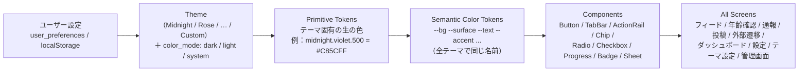

# 07. デザインシステム・テーマエンジン

> コンセプト：**同じUX × 自由なデザイン**
> レイアウト、操作の位置、情報の構造、アイコンの形、文字の階層は全テーマで共通です。テーマを変えて変わるのは「色のトークン」だけです。

## 0. 添付画像から読み取った値と、今回の採用値

| 項目 | 添付画像 ⑨のガイドライン | UIプロンプトの指定 | **採用** |
|---|---|---|---|
| 背景 | #0B0B0F | #090A0F | **#090A0F**（プロンプトを優先） |
| アクセント | #D946EF | #C85CFF / 補助 #8E5CFF | **#C85CFF → #8E5CFF のグラデーション**（CTAのみ） |
| フォント | Noto Sans JP / Inter | モダンな日本語ゴシック | **Noto Sans JP（和文）+ Inter（欧文・数字）** |
| 角丸 | 16px | 12〜18px | **12 / 16 / 18 / full** の4段階 |
| 余白 | 24 / 16 | 十分な余白 | **4ptグリッド**、画面の左右は16px、セクションの間は24px |

> TikTokとの差別化：TikTokのブランドカラー（シアン #25F4EE、レッド #FE2C55）と、その2色をずらして重ねる表現は**どのテーマでも使いません**。Oceanのシアン、Crimsonのレッドは色相と明度をずらした別の色にしています。ロゴは独自の筆記体「Glow」です（商標調査はQ1-3）。

---

## 1. トークンの階層



- **コンポーネントは Semantic Token だけを参照します**（生のHEX値を書くことは、ESLintとStylelintで禁止）。
- テーマの切り替え＝`<html data-theme="rose" data-mode="dark">` の書き換え、または `style` にCSS変数を入れるだけです。再描画はCSSだけで済み、JSのツリーは作り直しません。
- 画面が一瞬デフォルト色で表示されるのを防ぐため、`<head>` の中に小さなインラインスクリプトを置き、描画の前に `localStorage` からテーマを読み込みます。

## 2. Semantic Color Tokens（全テーマ共通の名前）

| トークン | 用途 |
|---|---|
| `--bg` | 画面の背景 |
| `--surface` | カード、シート、入力欄 |
| `--surface-2` | サブ背景、押したときの色、セグメント |
| `--border` | 1pxの区切り線（`--text` の8〜12%） |
| `--text` | メインの文字 |
| `--text-muted` | サブの文字（コントラスト比4.5以上を保証） |
| `--accent` | 選択状態、ラジオとチェックボックス、タブの下線、ナビの強調、進捗 |
| `--accent-2` | グラデーションの終わりの色（CTAだけで使う） |
| `--accent-fill` / `--accent-fill-2` | ボタンとCTAの塗りの色。`--on-accent` の文字とのコントラスト比が4.5以上になるよう、必要なら `--accent` より暗くした色（下の表） |
| `--on-accent` | 塗りの上に乗る文字（明るさから白か黒かを自動で決める） |
| `--focus-ring` | キーボード操作時の枠（`--accent` の60%） |
| `--scrim` | 動画の上のグラデーション（**テーマに関係なく常に暗い色**） |
| `--success` `--warning` `--danger` `--info` | ステータスのバッジ（**テーマに関係なく固定**。意味の色は変えない） |

> **動画の上のUIはテーマに関係なく「暗いスクリム＋白い文字」で固定します**。Minimal（ライト）のテーマでも、動画の上の文字が読めなくならないようにするためです。テーマが効くのは、ナビ、タブの下線、CTA、アイコンの選択状態、シート、設定画面です。

### 固定の意味色
| | Dark | Light |
|---|---|---|
| success（公開中） | #34C77B | #138A4B |
| warning（審査中） | #F5B544 | #A86400 |
| danger（差し戻し・通報） | #FF5A5F | #C62828 |
| info（非公開） | #8A8FA3 | #5B6070 |

## 3. テーマ一覧（Dark）

| テーマ | --bg | --surface | --surface-2 | --text | --text-muted | --accent | --accent-2 | --on-accent |
|---|---|---|---|---|---|---|---|---|
| **Midnight**（既定） | #090A0F | #151722 | #1D1F2B | #FFFFFF | #A8ABB8 | #C85CFF | #8E5CFF | #FFFFFF |
| **Rose** | #0B0809 | #1A1215 | #24181D | #FFFFFF | #B8A8AE | #FF6FA8 | #E2477F | #1A0A10 |
| **Ocean** | #070A10 | #111824 | #182131 | #FFFFFF | #A3AEC0 | #4DA3FF | #2E6BFF | #06101F |
| **Emerald** | #070B09 | #111A15 | #18241D | #FFFFFF | #A3B8AC | #3FD39A | #14A37A | #04140D |
| **Gold** | #0A0907 | #17140F | #211C15 | #FFF8EC | #B8AE9C | #D9B26A | #A8833F | #1A1206 |
| **Crimson** | #0B0707 | #1A1112 | #251719 | #FFFFFF | #BCA6A8 | #E5484D | #A8262C | #FFFFFF |
| **Minimal**（ライトが既定） | #FFFFFF | #F4F4F6 | #EAEAEE | #111114 | #5E606B | #111114 | #3A3B42 | #FFFFFF |
| **Custom** | ユーザーが指定 | 指定 | 自動で作る | 指定 | 自動で作る | 指定 | 「メインカラー」 | 自動で決める |

**ボタンの塗り（`--accent-fill` → `--accent-fill-2`）**：基本は `--accent` → `--accent-2` と同じです。ただし白い文字が4.5を下回る次の2テーマだけ、少し暗くした色にします（下の値は計算で確認済み）。
- Midnight：#A13BEB → #7B4BF0（白い文字とのコントラスト比 4.84 / 5.11。#C85CFFのままだと3.27で足りない）
- Crimson：#C9363B → #A8262C（5.15 / 7.05。#E5484Dのままだと3.91）
- 細い線や下線などのインジケーター（背景とのコントラスト比3.0以上が必要）には、明るい `--accent` をそのまま使います（全テーマで5.1以上）。

### Light（color_mode = light）
すべてのテーマで共通の考え方：`--bg #FFFFFF / --surface #F5F5F7 / --surface-2 #ECECF0 / --text #111114 / --text-muted #5E606B`。アクセントは各テーマの色を**白い背景でコントラスト比4.5以上になるまで暗くした色**にします。

| テーマ | Light --accent |
|---|---|
| Midnight | #8E2FD6 |
| Rose | #C42D6B |
| Ocean | #1E5FD1 |
| Emerald | #0D7D58 |
| Gold | #8A6420 |
| Crimson | #B42328 |
| Minimal | #111114（Dark版：bg #0E0E10 / accent #FFFFFF / on-accent #111114） |

> 「システム設定に合わせる」は `prefers-color-scheme` を見て、Dark版とLight版を自動で切り替えます。

## 4. タイポグラフィ・形・余白

| 種類 | サイズ / 行の高さ / 太さ | 用途 |
|---|---|---|
| Display | 28 / 36 / 700 | 年齢確認の見出し、ダッシュボードの大きな数値 |
| Title | 20 / 28 / 700 | 画面のタイトル、シートのタイトル |
| Headline | 17 / 24 / 600 | セクションの見出し、ボタン（大） |
| Body | 15 / 22 / 400 | 本文、入力欄 |
| Callout | 14 / 20 / 500 | タブ、リストの行 |
| Caption | 12 / 16 / 500 | タグ、補足、ナビのラベル |
| Micro | 11 / 14 / 500 | アクションの数値（12.3万） |
- 数字は Inter の `font-variant-numeric: tabular-nums` を使い、数値が変わっても横にずれないようにします。
- 最小の文字サイズは11pxです。本文は15px以上にします。

| 形 | 値 |
|---|---|
| 角丸 | `--radius-sm 12px`（入力欄、チップ）/ `--radius-md 16px`（カード、ボタン）/ `--radius-lg 18px`（シート上部、テーマカード）/ `--radius-full`（CTA、アバター） |
| 余白 | 4 / 8 / 12 / 16 / 24 / 32 / 48。画面の左右は16px |
| 影 | ダークでは使わず、`--border` と明度の差で階層を表す。ライトでは `0 1px 2px rgba(0,0,0,.06)` |
| ぼかし | シートの背景は `--scrim` ＋ `backdrop-filter: blur(16px)` |

## 5. Customテーマの安全装置
1. ユーザーが決める5色：メインカラー（`--accent-2`）、アクセント（`--accent`）、背景（`--bg`）、カード（`--surface`）、文字（`--text`）
2. 自動で作る色：`--surface-2` はカードを背景の方向へ6%寄せた色、`--text-muted` は文字を背景と混ぜてコントラスト比4.5になる色、`--on-accent` は明るさから白か黒を選んだ色、`--border` は文字の10%
3. **コントラストの検査**（WCAG 2.2）：文字と背景、文字とカードが4.5未満のとき、アクセントと背景が3.0未満のときは「読みにくい配色です」と警告し、「自動で補正」ボタンを出します。保存はできますが、補正の案を出します。サーバー側でも、HEXの形式と、文字と背景が4.5以上かを検証します。
4. 「リセット」で、そのときに選んでいたプリセットの値に戻します。

## 6. アイコン

- 独自に作ったアイコンセットを使います。最初は **Lucide**（ISCライセンス）をベースに、`stroke-width: 1.75`、線の端と角を丸めて統一します。TikTok独自の形（音符のロゴなど）は使いません。
- サイズ：ナビ24px、アクション列28px、リスト20px。タップ領域は最小44×44px（アクション列は48×48px）。
- 状態：選択されていないときは線だけで `--text`。選択中は**塗りつぶして `--accent`**（例：お気に入りのハート、ナビのアイコン）。
- 中央の「＋投稿」：36×36pxの角丸スクエア（radius 10）を `--accent-fill` で塗り、その上に `--on-accent` 色の＋を置きます。

| 機能 | Lucide名 | 機能 | Lucide名 |
|---|---|---|---|
| ホーム | `house` | お気に入り | `heart` |
| 探す | `compass` | 共有 | `send` |
| 投稿 | `plus` | 通報 | `flag` |
| お気に入り（ナビ） | `bookmark` | その他 | `ellipsis` |
| マイページ | `user-round` | 外部リンク | `arrow-up-right` |
| 検索 | `search` | 音 | `volume-2` / `volume-x` |
| テーマ | `palette` | 設定 | `settings` |
| コメント | `message-circle` | | |

## 7. 主要なコンポーネント（Figmaのコンポーネント名をそのまま使う）

| コンポーネント | 仕様 |
|---|---|
| `Button/Primary-CTA` | 高さ52、角は丸く、`linear-gradient(90deg, var(--accent-fill), var(--accent-fill-2))`、文字は `--on-accent` の17/600、右に矢印アイコン。押したときは `scale(.98)` |
| `Button/Primary` | 高さ48、radius 16、`--accent-fill` で塗る |
| `Button/Secondary` | 高さ48、radius 16、`--surface-2` で塗る、または `--border` の枠線 |
| `Button/Ghost` | 文字だけ、`--text-muted` |
| `TopTabs` | 3つのタブ、Callout 14、選択中のタブは `--text`＋下線（幅20、高さ3、角は丸く、`--accent`）、それ以外は `--text-muted` |
| `ActionRail/Item` | アイコン28＋数値（Micro）、タップ領域48×48、間隔16 |
| `BottomNav` | 高さ56＋セーフエリア、背景は `--bg` の90%＋ぼかし、上に1pxの `--border` |
| `Sheet` | 上の角はradius 18、つまみ（36×4）、タイトルは Title 20、閉じるのは×ボタンか下へのスワイプ |
| `Radio` / `Checkbox` | 22px、選択されると `--accent` で塗る、ラベルは Body 15、行の高さは48 |
| `Input` | 高さ48、radius 12、`--surface`、フォーカスすると2pxの `--focus-ring` |
| `Chip/Tag` | 高さ28、radius full、`--surface-2`、`#` が付いたCaption |
| `Badge/Status` | 高さ22、radius full、意味色の16%を背景、100%を文字色にする |
| `StatCard` | radius 16、`--surface`、ラベルはCaption、値は Display 24 で数字は等幅、前の期間との増減（▲は`--success`） |
| `ThemeCard` | 96×128、radius 18、上半分はミニフィードのサムネイル、下にテーマ名。選択中は2pxの `--accent` の枠＋チェック |
| `ThemePreview` | 実際の `FeedItem` コンポーネントを `transform: scale(.42)` で縮めて表示し、**CSS変数をその要素の中だけで上書き**する。これで、まだ適用していない色がリアルタイムに反映される |
| `ColorField` | 色のプレビュー（32×32、radius 8）＋HEXの入力欄＋ピッカー（`<input type=color>`、または独自のHSVピッカー） |

## 8. テーマ設定画面（V-16 / V-17）のレイアウト
```
┌──────────────────────────┐
│ ‹  デザイン・テーマ                  │  ← ナビゲーションバー
│ ┌──────────┐                       │
│ │ ThemePreview │  ← 高さ約300、実際のフィードを縮めたもの
│ └──────────┘                       │
│ テーマ                               │
│ [Midnight][Rose][Ocean][Emerald]→  │  ← 横スクロールするThemeCard
│ 表示モード                           │
│ (ダーク | ライト | システム)          │  ← 3つに分かれたSegmented control
│ カスタマイズ                    ›    │  ← Customのとき
│                                      │
├──────────────────────────┤
│ [   このテーマを適用   ]              │  ← 下に固定（セーフエリアの上）
└──────────────────────────┘
```
カスタマイズ画面（V-17）：上に同じ `ThemePreview`（スクロールしても上に残る）→ ColorFieldを5つ（メインカラー、アクセント、背景、カード、文字）→ コントラストの警告 → 下に固定で「リセット」（Secondary、幅1/3）と「保存して適用」（Primary、幅2/3）。

## 9. デザインの成果物（次の作業として提案）
- UIプロンプト【18】の「1枚の巨大なプレゼンテーションボード」（①〜⑪）は、**フェーズ2でデザイントークンを実装したあと、実際のコンポーネントを並べたHTMLのボード（`/design-board`）として作る**ことを提案します。画像を生成するよりも寸法と色が正確で、そのままFigmaに取り込んだり、スクリーンショットで共有したりできます（Q1-4）。
